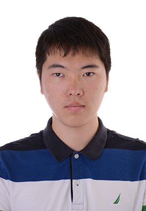
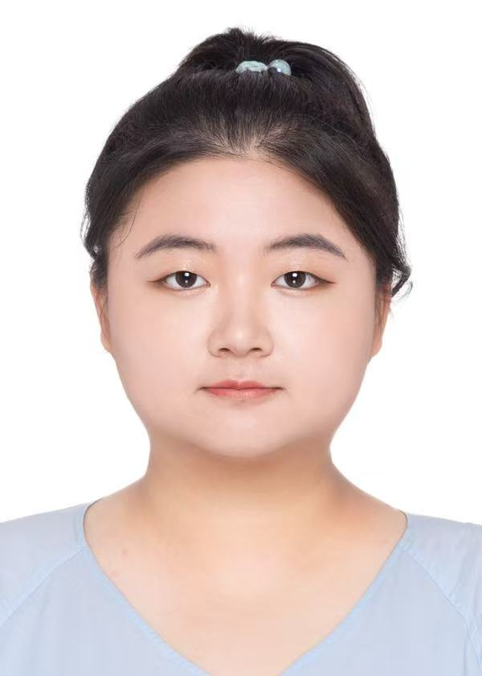
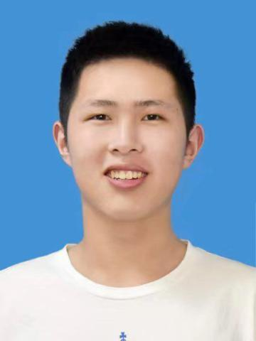
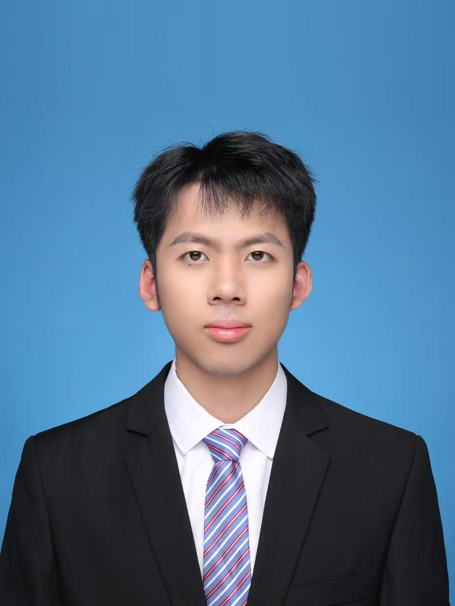
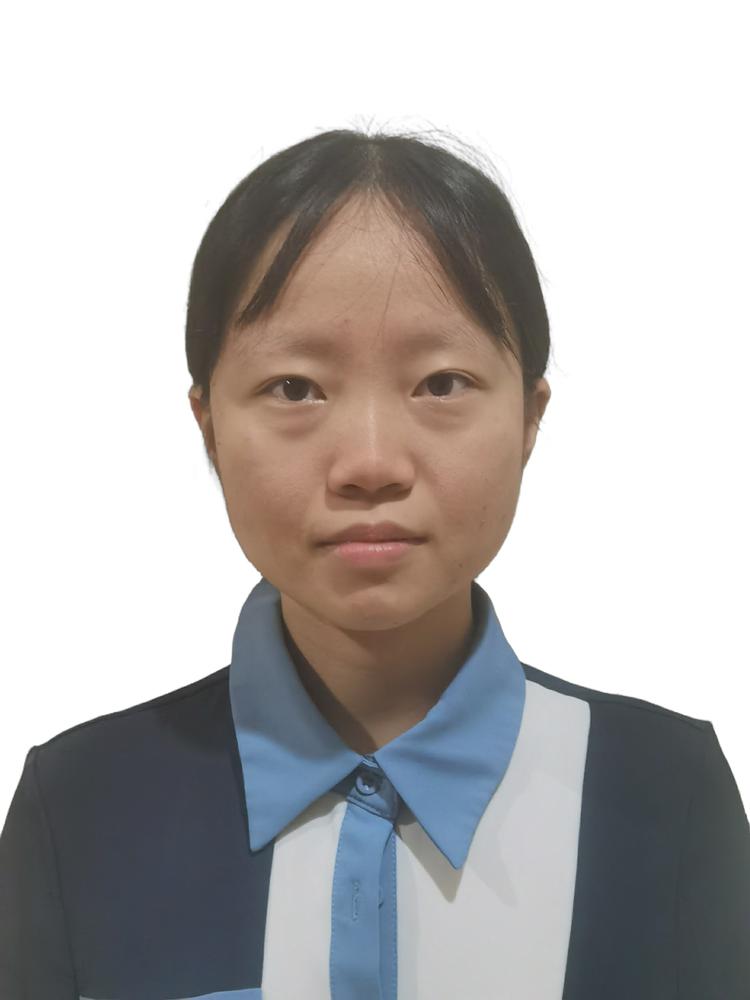
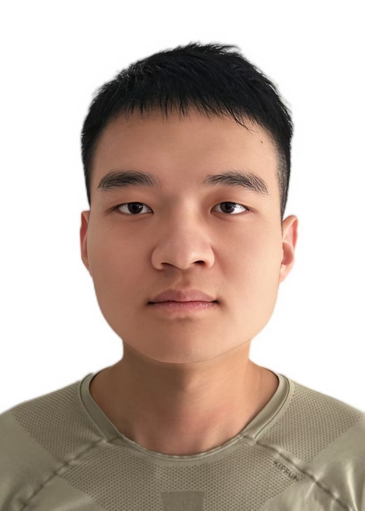
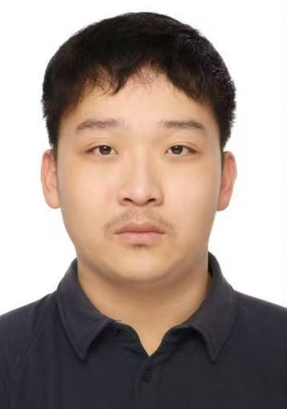
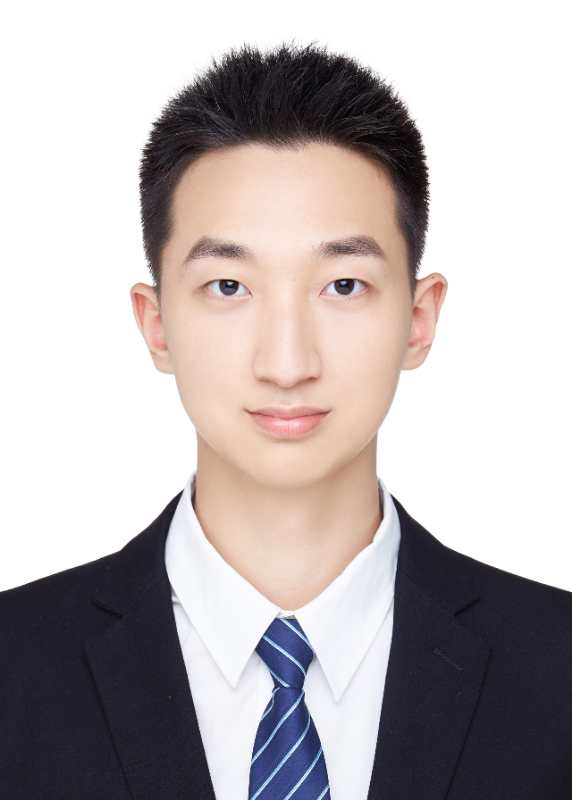

# Research Team | Igor's Laboratory

[← Back to Homepage](./index.md)

---

## Senior Researchers

  

  
  ### Rulin Feng (冯儒林)
  
  
  **Position:** Assistant Researcher  
  **Research Focus:** Multi-Configuration Pair Density Functional Theory (MC-PDFT)  
  **Personal Website:** [Acadamic Profile](members/rlfeng.md)
  
  

  
  

  
  ### Wenjie Yan (颜文杰)
  
  
  **Position:** Assistant Researcher  
  **Research Focus:** Organizes REST program workshops and develops machine learning algorithms for XPaiNN.  
  **Personal Website:** [Acadamic Profile](members/wjyan.md)
  
  

  
  

  
  ### Andrew J. Zhu (祝震予)
  
  
  **Position:** Postdoctoral Fellow  
  **Research Focus:** Focuses on optimizing REST program code and developing GPU-based low-scale algorithms.  
  **Personal Website:** [Acadamic Profile](members/zyzhu.md)
  
  

  

  
  ### Shengyang Cai (蔡升阳)
  
  
  **Position:** Postdoctoral Fellow  
  **Research Focus:** Develops and applies XO-REST method for complex biological systems.  
  **Personal Website:** [Acadamic Profile](members/sycai.md)
  
  

--- 

## PhD and Master Students

  

  
  ### Yajing Li (李亚静)
  
  
  **Position:**  PhD Student  
  **Research Focus:** Bayesian analysis-based enhanced sampling methods and XPaiNN machine learning potential training.  
  **Personal Website:** [Acadamic Profile](members/yjli.md)
  
  

  

  
  ### Zhiyun Li (李之韵)
  
  
  **Position:**  Master Student  
  **Research Focus:** ISDF-based lower-scaling HF and xDH algorithm in REST.  
  **Personal Website:** [Acadamic Profile](members/zyli.md)
  
  

  

  ### Yilin Zhao (赵懿璘)
  
  
  **Position:**  PhD Student  
  **Research Focus:** Embeding XO-PBC method and its application for complex systems.  
  **Personal Website:** [Acadamic Profile](members/ylzhao.md)
  
  

  

  
  ### Lingyue Yu (虞凌岳)
  
  
  **Position:**  PhD Student  
  **Research Focus:** xDH method development in the restricted open-shell (RO) framework using REST program.  
  **Personal Website:** [Acadamic Profile](members/lyyu/index.md)
  
  

  

  
  ### Haibei Yang (杨海贝)
  
  
  **Position:**  PhD Student  
  **Research Focus:** Computational intelligence agents for complex systems using REST program.  
  **Personal Website:** [Acadamic Profile](members/hbyang/index.md)
  
  

  

  
  ### Zihan Lin (林子涵)
  
  
  **Position:**  PhD Student  
  **Research Focus:** RRS-PBC and machine-learning-based Hamiltonian generation algorithm for periodic systems using REST program.  
  **Personal Website:** [Acadamic Profile](members/zhlin/index.md)
  
  

  

  
  ### Shiyue Mei (梅诗玥)
  
  
  **Position:**  PhD Student  
  **Research Focus:** Implementation of Pseudo-potential and PCM in REST for advanced doubly hybrid approximations.  
  **Personal Website:** [Acadamic Profile](members/symei/index.md)
  
  

  

  
  ### Jiapei Zou (邹嘉沛)
  
  
  **Position:**  Master Student  
  **Research Focus:** Implements relativistic methods (spin-orbit coupling, X2C) in REST and applies them to rare-earth element systems.  
  **Personal Website:** [Acadamic Profile](members/jpzou/index.md)
  
  

  

  
  ### Yizhou Xu (徐弋洲)
  
  
  **Position:**  PhD Student  
  **Research Focus:** Development and application of vdW-corrected DFAs  
  **Personal Website:** [Acadamic Profile](members/yzxu/index.md)
  
  

  

  
  ### Liming Chen (陈礼明)
  
  
  **Position:**  PhD Student  
  **Research Focus:** Develops and applies xDH methods compined with QM/MM and molecular dynamics for spectroscopic simulation within the REST framework.  
  **Personal Website:** [Acadamic Profile](members/lmchen/index.md)
  
  

  

  
  ### Fanghang Chen (陈方航)
  
  
  **Position:**  PhD Student  
  **Research Focus:** Machine learning density functional methods combining specialized and general-purpose approaches (DFT-Net).  
  **Personal Website:** [Acadamic Profile](members/fhchen/index.md)
  
  

  

  
  ### Qirui Gao (高琪芮)
  
  
  **Position:**  PhD Student  
  **Research Focus:** develops and applies quasi-particle methods (GW/BSE) to quantum computer design.    
  **Personal Website:** [Acadamic Profile](members/qrgao/index.md)
  
  

---

## Alumni
*Previous team members who have moved on to new positions.*

[← Back to Homepage](./index.md)
