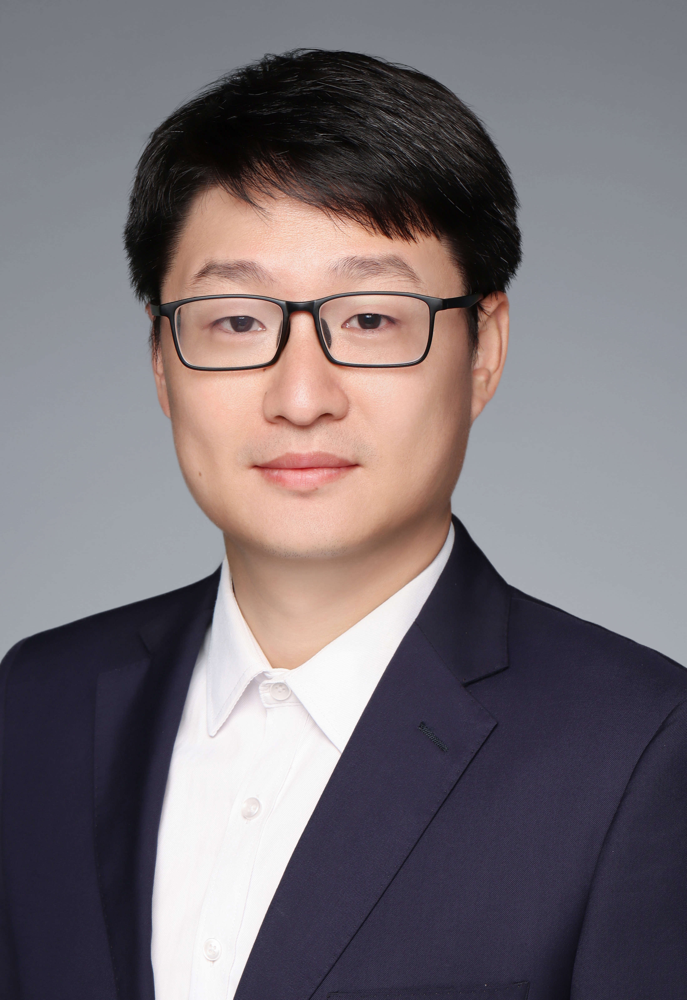
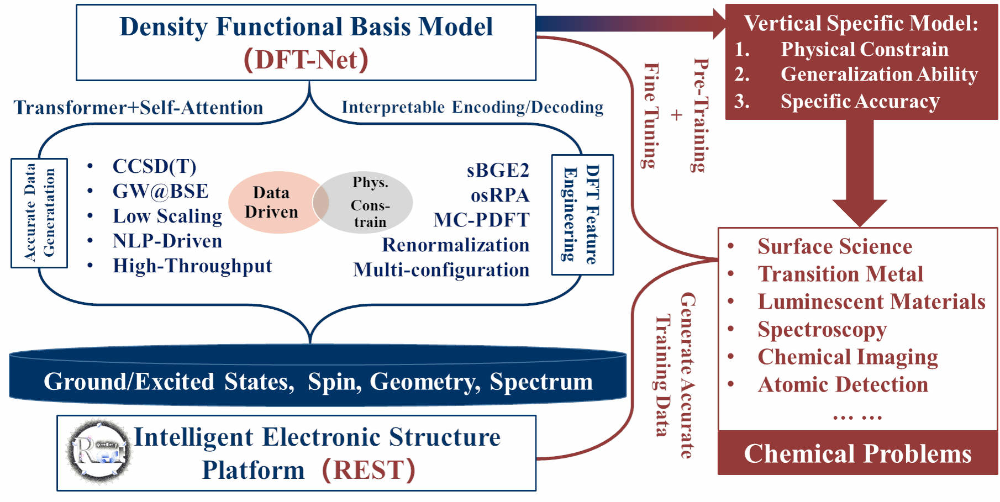

# Professor Igor Ying Zhang

**Professor at Fudan University | Deputy Director, Research Center of Chemical Theory (RCCT)**

 
  
 
     
  
 
  
 
    <h2 style="margin-top: 0;">Biography</h2> 
    
 Prof. Igor Ying Zhang is a Professor at Fudan University. He holds dual PhD degrees from Xiamen University (China) and the Royal Institute of Technology (KTH, Sweden). He conducted postdoctoral research at the Fritz Haber Institute of the Max Planck Society in Germany and later became an independent research group leader.

    
 Prof. Zhang has authored over 80 peer-reviewed papers and published the first international monograph on doubly hybrid functionals, A New-Generation Density Functional (Springer, first author). He has received several prestigious awards, including the <strong>National Natural Science Foundation of China (NSFC) Distinguished Young Scholar Award</strong> and the <strong>Chinese Chemical Society Youth Award in Theoretical Chemistry</strong>.

  
 

<!--  

---

## 📚 Biography

Prof. Igor Ying Zhang (born 1982) is a Professor at Fudan University and Deputy Director of the Research Center of Chemical Theory (RCCT). He holds dual PhD degrees from Xiamen University (China) and the Royal Institute of Technology (KTH, Sweden). He conducted postdoctoral research at the Fritz Haber Institute of the Max Planck Society in Germany and later became an independent research group leader.

Prof. Zhang has authored over 80 peer-reviewed papers (cited more than 8,500 times, H-index 33) and published the first international monograph on doubly hybrid functionals, *A New-Generation Density Functional* (Springer, first author). He has received several prestigious awards, including the **National Natural Science Foundation of China (NSFC) Distinguished Young Scholar Award** and the **Chinese Chemical Society Youth Award in Theoretical Chemistry**.
-->

---

## 🧬 Research Focus

Prof. Zhang's research is centered on developing high-accuracy density functional theory methods and the software needed to apply them to challenging chemical problems.

*   **Advancing and Extending Doubly Hybrid Functionals (xDH & R-xDH)**
    *   He is a principal founder of the **XYG3-type doubly hybrid functionals**, which achieve chemical accuracy for main-group chemistry without augmented empirical dispersion corrections. The xDH framework is widely recognized and adopted in the field.
    *   He further extended this paradigm to **strongly correlated systems**, developing the **ZRPS functional** for two-body correlations and the **renormalized R-xDH framework** (including the machine-learning-enhanced R-xDH7-SCC15 method) for many-body correlations, enabling accurate studies of bond dissociation and transition-metal chemistry.

*   **Bridging DFT with Multireference Theory via Cross-Entropy Correction**
    *   To tackle strong correlation beyond the single-reference framework, Prof. Zhang proposed a **generalized hybrid multiconfiguration pair-density functional theory (HMC-PDFT)** by introducing a cross-entropy term, yielding a comprehensive improvement over existing MC-PDFT methods. The resulting **tB4LYP functional** demonstrates superior accuracy to CASPT2 while retaining CASSCF-like computational efficiency, providing a powerful tool for photochemistry and catalysis.

*   **Developing High-Performance Software: From Algorithm to Platform**
    *   In established software ecosystems (e.g., FHI-aims), he pioneered the implementation of scalable algorithms and periodic doubly hybrid functionals, enabling large-scale parallel computation.
    *   Leveraging deep software expertise, he independently led the development of the **Rust-based REST platform**, designed to efficiently support advanced functionals like xDH and R-xDH, making high-accuracy electronic structure methods more accessible and practical.

---

## 👥 Team & Projects

*   **[Research Group & Members](group.md)** - Meet our dynamic research team.
*   **[Ongoing Research Projects](projects.md)** - Explore our current cutting-edge research topics.
*   **🚀 [REST Electronic Structure Package](https://gitee.com/restgroup)** - We proudly present **REST**, the world's first Rust-based electronic structure package developed by our research group. **REST** aims to revolutionize quantum chemistry software with modern programming paradigms, offering exceptional performance, safety, and maintainability. We welcome everyone to download and use **REST**, and join our open-source community to contribute to its development and advance the field together!

---

## 📧 Contact

*   **Address**: Department of Chemistry, Fudan University, 2005 Songhu Road, Shanghai, China
*   **Email**: [igor_zhangying@fudan.edu.cn]
*   **ORCID**: [0000-0002-8703-1912]

---

## 📄 Selected Representative Publications
1. Zhang, I. Y.; Xu, X. A New-Generation Density Functional - Towards Chemical Accuracy for Chemistry of Main Group Elements, *SpringerBriefs in Molecular Science.; Springer-Verlag*, **2014**.
2.  Li, Z.; Gao, T.; Wang, S.; ...; Zhang, I. Y.; Xu, X. REST: Embracing the Rust Programming Language for Modern Electronic Structure Theory. *Chin. J. Chem. Phys.* **2025**. [doi](https://cjcp.ustc.edu.cn/hxwlxb/article/doi/10.1063/1674-0068/cjcp2510156)
3.  Zhang, Y.; Xu, X.; Goddard, W. A. Doubly Hybrid Density Functional for Accurate Descriptions of Nonbond Interactions, Thermochemistry, and Thermochemical Kinetics. *Proc. Natl. Acad. Sci. USA* **2009**, *106* (13), 4963–4968.
4.  Zhang, I. Y.; Xu, X.; Jung, Y.; Goddard, W. A. A Fast Doubly Hybrid Density Functional Method Close to Chemical Accuracy Using a Local Opposite Spin Ansatz. *Proc. Natl. Acad. Sci. USA* **2011**, *108* (50), 19896–19900.
5.  Zhang, I. Y.; Rinke, P.; Perdew, J. P.; Scheffler, M. Towards Efficient Orbital-Dependent Density Functionals for Weak and Strong Correlation. *Phys. Rev. Lett.* **2016**, *117* (13), 133002.
6. Zhang, I. Y.; Xu, X. On the Top Rung of Jacob’s Ladder of Density Functional Theory: Toward Resolving the Dilemma of SIE and NCE. *WIREs Computational Molecular Science* **2021**, *11* (1), e1490. https://doi.org/10.1002/wcms.1490.
7. Wang, Y.; Li, Y.; Chen, J.; Zhang, I. Y.; Xu, X. Doubly Hybrid Functionals Close to Chemical Accuracy for Both Finite and Extended Systems: Implementation and Test of XYG3 and XYGJ-OS. *JACS Au* **2021**, *1* (5), 543–549. https://doi.org/10.1021/jacsau.1c00011.
8.  Wang, Y.; Lin, Z.; Ouyang, R.; Jiang, B.; Zhang, I. Y.; Xu, X. Toward Efficient and Unified Treatment of Static and Dynamic Correlations in Generalized Kohn–Sham Density Functional Theory. *JACS Au* **2024**, *4* (8), 3205–3216.
9.  Feng, R.; Zhang, I. Y.; Xu, X. A Cross-Entropy Corrected Hybrid Multiconfiguration Pair-Density Functional Theory for Complex Molecular Systems. *Nat Commun* **2025**, *16* (1), 235.
10. Cai, S.; Weng, J.; Zhang, I. Y.; Zhu, Y. Unraveling the Catalytic Mechanism and Substrate Selectivity of HDAC10: A Dual-Filter Approach for Polyamine Deacetylation. *JACS Au* **2025**, *5* (9), 4491–4505. https://doi.org/10.1021/jacsau.5c00842.

*For a complete publication list, please visit [Google Scholar](https://scholar.google.com/citations?user=LvJYWPwAAAAJ&hl=en) or [Scholarmate](https://www.scholarmate.com/psnweb/homepage/show?module=pub)*

---

**© 2025 Zhang Research Group | Last Updated: [2025-12-07]**
