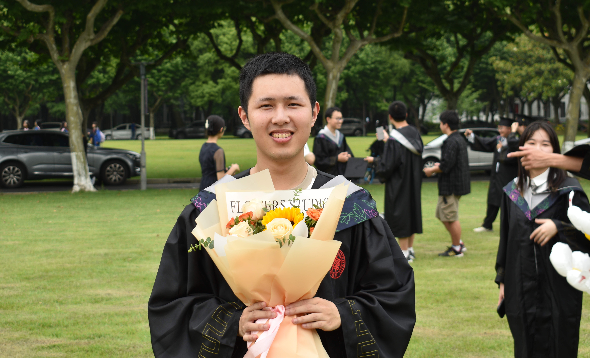

[Back to Lab Homepage](../../index.md)

# Lingyue Yu (虞凌岳)

  
  
  **Position:** [Position, e.g., Postdoctoral Fellow/PhD Student]  
  **Email:** [email@university.edu]  
  **Office:** [Building Name, Room Number]  
  **ORCID:** [0000-0000-0000-0000]

---

## 🔬 Research Focus
*A brief paragraph describing your main research interests (2-4 sentences).*

- **Primary Area:** [e.g., Computational Chemistry, Machine Learning]
- **Key Methods:** [e.g., Density Functional Theory, Molecular Dynamics]
- **Application Areas:** [e.g., Catalyst Design, Energy Materials]

*Example: My research focuses on developing machine learning potentials for accelerating molecular dynamics simulations. I am particularly interested in applying these methods to study heterogeneous catalysis and battery materials.*

---

## 📚 Education

| Degree | Field | Institution | Year |
|--------|-------|-------------|------|
| Ph.D. | [Field] | [University Name] | [Year] |
| M.S. | [Field] | [University Name] | [Year] |
| B.S. | [Field] | [University Name] | [Year] |

---

## 📄 Selected Publications
*List 5-10 most significant publications*

### **First-author Papers**
1. **Lastname, F.**, Coauthor, A., & Senior, P. (Year). *Title of the paper*. **Journal Name**, *Volume*(Issue), Pages. [DOI/link]
2. **Lastname, F.** et al. (Year). *Title*. **Journal**, *Vol*, Pages.

### **Co-authored Papers**
3. Coauthor, A., **Lastname, F.**, et al. (Year). *Title*. **Journal**, *Vol*, Pages.
4. Senior, P., **Lastname, F.**, et al. (Year). *Title*. **Journal**, *Vol*, Pages.

### **Preprints & Under Review**
5. **Lastname, F.**, et al. (Year). *Title*. arXiv:XXXX.XXXX

**[Google Scholar Profile](https://scholar.google.com/citations?user=ID)** | **[ORCID Record](https://orcid.org/ID)**

---

## 🛠️ Projects & Contributions

### Active Projects
- **[Project 1 Name]** - Brief description of your role and contributions
- **[Project 2 Name]** - Tools/methods used and key objectives

### Software Development
- **[Repository Name]** - Description of your contributions to group software
- **[Open Source Project]** - Links to public code repositories

---

## 🏆 Awards & Honors
- [Award Name], [Organization], [Year]
- [Fellowship Name], [Funding Agency], [Year]
- [Best Poster Award], [Conference Name], [Year]

---

## 🎓 Academic Service
- **Reviewer** for: [Journal 1], [Journal 2]
- **Conference Participation:** [Conference Name, Year] (Oral/Poster)
- **Teaching Assistant:** [Course Name, Semester Year]

---

## 📢 Presentations & Talks

### Invited Talks
1. "*Talk Title*", [Event Name], [Location], [Date]

### Conference Presentations
1. "*Poster Title*", [Conference Name], [Location], [Date]
2. "*Contributed Talk*", [Conference Name], [Location], [Date]

---

## 📍 Personal
*A short section about non-academic interests (optional but recommended)*

- **Hobbies:** [e.g., Hiking, Photography, Music]
- **Languages:** [e.g., English, Chinese, Spanish]
- **Other:** Any interesting personal facts or extracurricular activities

---

## 🔗 Quick Links
- [Back to Lab Homepage](../../index.md)

---

<small>Last updated: Month Day, Year</small>
