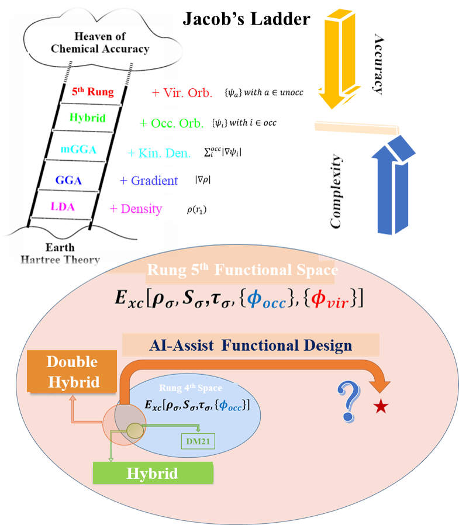

# On-going Research Projects | Igor's Lab

[← Back to Homepage](./index.md)

## Project 1: Specialized-Generalized DFT Foundation Model (DFT-Net)

This core project aims to develop **DFT-Net**, a transformative AI foundation model for intelligently constructing high-level density functionals.

**Ultimate Goal:** Establish a new **AI-DFT paradigm** that consistently achieves chemical accuracy (~1 kcal/mol) while maintaining first-principles interpretability and computational efficiency.

  
 
    
  

---

## Project 2: Construction of Autonomous and Controllable Precision Chemistry Databases
We are leveraging our in-house **REST** electronic structure platform to systematically generate high-fidelity datasets, addressing the scarcity of reliable data for complex chemical systems.

### 2.1 High-Efficiency Implementation of High-level Wavefunction Methods
*   **Goal:** Enhance the applicability and computational efficiency of high-level *ab initio* methods for generating accurate reference data.

### 2.2 Quasiparticle (QP) Computational Approach: BSE@GW
*   **Goal:** Establish a high-accuracy framework for calculating ionization potentials, electron affinities, and neutral excited states in finite molecular systems.

### 2.3 Natural Language-Driven Intelligent Computing Platform & Database Agent
*   **Goal:** Create a fully automated, high-throughput workflow for computational data generation and database construction.

---

## Project 3: Physically Constrained High-Level Functional Descriptors
We are moving beyond standard models to design novel descriptors that incorporate information from **unoccupied orbitals** and **multi-configurational** effects, targeting the top rung of Jacob's Ladder.

*   **Key Directions:**
    1.  **Fifth-Rung Descriptors:** Explore descriptors beyond second-order perturbation theory (PT2), utilizing indicators from renormalized double-hybrid development (e.g., BGE2 coupling effects, osRPA response function norms).
    2.  **Multi-Configurational Descriptors:** Leverage insights from the MC-PDFT framework (e.g., the relationship between natural orbital occupation entropy and static correlation) to design descriptors for strongly correlated systems.
    3.  **QP-Inspired Descriptors:** Draw inspiration from the quasiparticle picture in GW/BSE methods to inform descriptor design for ionization and excitation properties.
*   **Methodology:** Employ unsupervised learning strategies on our precision databases to discover universal "factors" or "genes" for constructing exchange-correlation functionals, ensuring physical constraints are embedded.

---

## Project 4: Next-Generation Intelligent Electronic Structure Platform Integration
This project focuses on integrating the outputs of Projects 1-3 into a unified, user-accessible ecosystem.

  
 
    
  

*   **Platform Elevation:** Evolve the **REST** software from a high-performance computational tool into a **next-generation intelligent electronic structure platform**.
*   **Cloud-Based High-Throughput Platform:** Build a cloud-enabled platform that facilitates automated, high-throughput production of precise chemical data.
*   **Closed-Loop Framework:** Realize the vision of a "**data-algorithm-theory**" closed loop, where generated data feeds AI models (DFT-Net), which in turn improve theoretical methods and guide new computational campaigns.
    *   Build specialized databases covering ground- and excited-state properties for both main-group and transition metal systems.

[← Back to Homepage](./index.md)
